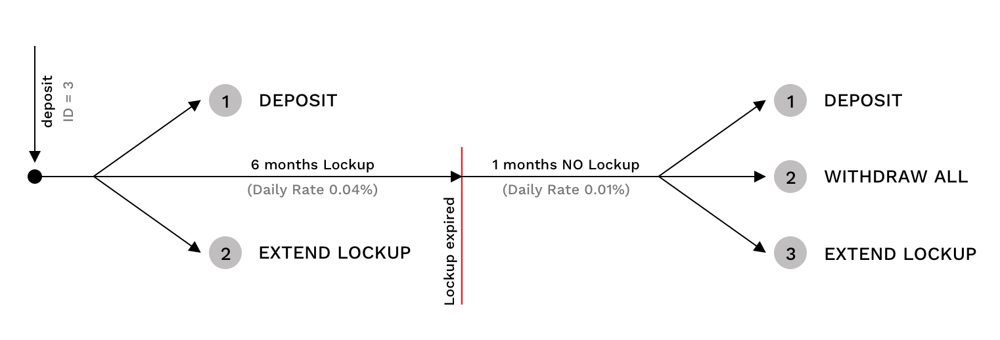
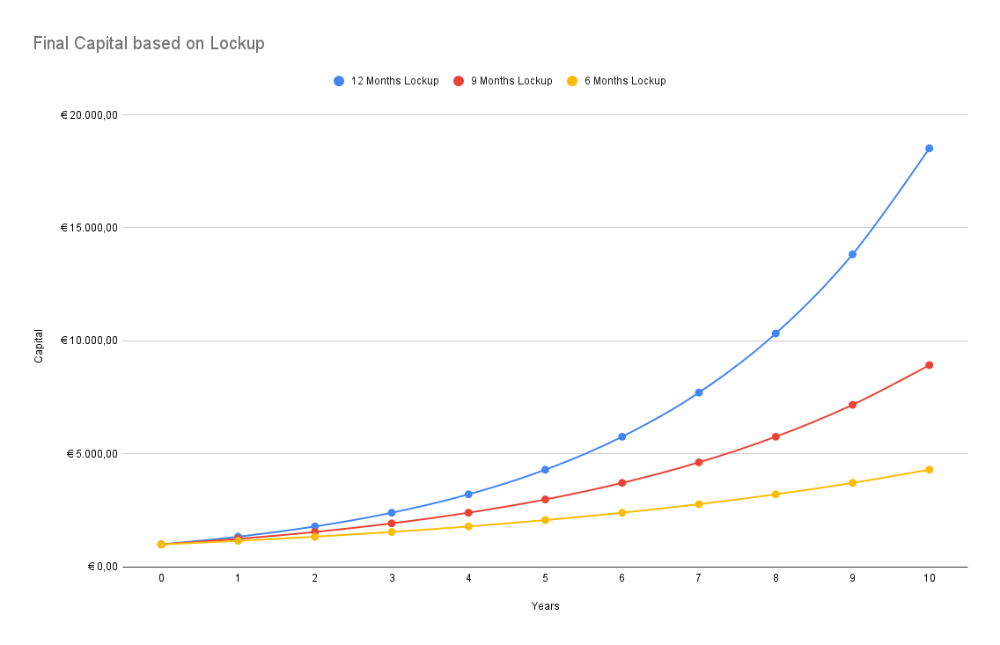

 


# OVR StakingV2 Documentation

The staking contract allows users to deposit OVR and receive rewards in 5 different ways.

| Stake Mode ( depositId ) | 1                                                               | 2        | 3        | 4         | 5         |
| ------------------------ | --------------------------------------------------------------- | -------- | -------- | --------- | --------- |
| Period Lockup            | No Lockup time (I can withdraw capital and rewards at any time) | 3 Months | 6 Months | 9 Months  | 12 Months |
| Daily Interest Rate      | 0.01%                                                           | 0.03%    | 0.04%    | **0.06%** | **0.08%** |
| Gain after 365 days      | 3.7%                                                            | 11.6%    | 15.7%    | 24.5%     | 33.9%     |

To calculate the final balance, the smart contract uses the formula of compound daily interest:

 

- **A** the future value of the investment
- **C** the principal investment amount
- **r** the daily interest rate (based on depositId)
- **n** the number of days the money is invested for (timestamp / 1 days)


Once the lockup period has been completed after deposit, it is possible to:

1. Make a new deposit. 
2. Withdraw the balance previously deposited and related rewards.
3. Extend previous lockup. For example if I deposited in mode 4 (9 months), I can extend the lockup for another 9 months after lookup period expiration.


In this example case below, rewards are calculated for the duration of 6 months with an APY of 15.7%, for the entire duration after the expired lockup the rewards are calculated with minimum APY (3.7%). The total rewards are the sum of:

- 6 months 0.04% Daily Interest Rate
- 1 month 0.01% Daily Interest Rate

 

```
Example

deposit = 500 OVR
depositId = 3
Daily Interest Rate 0.04%

... 7 months passed (2629743 seconds * 7) ...

Capital_6_months = 500 (1 + 0.04%)^180 => 537.319 OVR 
finalCapital = 537.319 (1 + 0.01%)^30) => 538.933 OVR
```

The only transactions allowed during the lockup period are deposit and lockup extension. It is not possible to withdraw during the locked period.

If another deposit occur during the blocking period, the reference balance will be calculated by adding the final balance generated by the predefined interest rate up to that moment and the new deposit. From then on, new rewards will be generated.

The same happens for lockup extension. If you request for a lockup extension during the block period, balance will be updated with rewards generated up to that moment, and lockup time restart from time 0.


Every time an operation is made (DEPOSIT | WITHDRAW | LOCKUP EXTENSION), the calculation of new balance is carried out, which takes into account the locked period and the non-locked period.

## Project Usage

Compile Contracts:
```
npx hardhat compile
```

Run tests:

```
npx hardhat test
```

To use hardhat-tracer
```
npx hardhat test --logs
```


--------

Here is a graph of compound performance with an initial budget of 1000 OVR.
 


--------


## This project uses [Hardhat](https://hardhat.org/)

Hardhat is a development environment to compile, deploy, test, and debug your Ethereum software. It helps developers manage and automate the recurring tasks that are inherent to the process of building smart contracts and dApps, as well as easily introducing more functionality around this workflow. This means compiling, running and testing smart contracts at the very core.

Hardhat Runner, the CLI command to interact with Hardhat, is an extensible task runner. It's designed around the concepts of `tasks` and `plugins`. Every time you're running Hardhat from the CLI you're running a task. E.g. npx hardhat compile is running the built-in compile task. Tasks can call other tasks, allowing complex workflows to be defined. Users and plugins can override existing tasks, making those workflows customizable and extendable.


[Configuration Project Setup](https://blog.oliverjumpertz.dev/how-to-set-up-a-solidity-project-and-create-your-first-smart-contract)

## Running tasks

To first get a quick sense of what's available and what's going on, run this command in your project folder:

```
npx run hardhat
```
You will see
```
Hardhat version 2.0.8

Usage: hardhat [GLOBAL OPTIONS] <TASK> [TASK OPTIONS]

GLOBAL OPTIONS:

  --config              A Hardhat config file.
  --emoji               Use emoji in messages.
  --help                Shows this message, or a task's help if its name is provided
  --max-memory          The maximum amount of memory that Hardhat can use.
  --network             The network to connect to.
  --show-stack-traces   Show stack traces.
  --tsconfig            Reserved hardhat argument -- Has no effect.
  --verbose             Enables Hardhat verbose logging
  --version             Shows hardhat's version.


AVAILABLE TASKS:

  accounts      Prints the list of accounts
  check         Check whatever you need
  clean         Clears the cache and deletes all artifacts
  compile       Compiles the entire project, building all artifacts
  console       Opens a hardhat console
  flatten       Flattens and prints contracts and their dependencies
  help          Prints this message
  node          Starts a JSON-RPC server on top of Hardhat Network
  run           Runs a user-defined script after compiling the project
  test          Runs mocha tests

To get help for a specific task run: npx hardhat help [task]
```

## Example Task

If you take a look at the `hardhat.config.js` file, you will find the definition of the task accounts:


```javascript
require("@nomiclabs/hardhat-waffle");

// This is a sample Hardhat task. To learn how to create your own go to
// https://hardhat.org/guides/create-task.html
task("accounts", "Prints the list of accounts", async (taskArgs, hre) => {
  const accounts = await hre.ethers.getSigners();

  for (const account of accounts) {
    console.log(account.address);
  }
});

// You need to export an object to set up your config
// Go to https://hardhat.org/config/ to learn more

/**
 * @type import('hardhat/config').HardhatUserConfig
 */
module.exports = {
  solidity: "0.8.4",
};
```

You will se:

```javascript
$ npx hardhat accounts
0xf39Fd6e51aad88F6F4ce6aB8827279cffFb92266
0x70997970C51812dc3A010C7d01b50e0d17dc79C8
0x3C44CdDdB6a900fa2b585dd299e03d12FA4293BC
...
```

## Compiling your contracts


```javascript
npx hardhat compile
```

## Testing your contracts

The sample project comes with these tests that use `Waffle` and `Ethers.js`. You can use other compatible libraries. Check the integrations described in our guides.

If you take a look at `test/`, you should be able to find `sample-test.js`:

```javascript
const { expect } = require("chai");

describe("Greeter", function () {
  it("Should return the new greeting once it's changed", async function () {
    const Greeter = await ethers.getContractFactory("Greeter");
    const greeter = await Greeter.deploy("Hello, world!");
    await greeter.deployed();

    expect(await greeter.greet()).to.equal("Hello, world!");

    const setGreetingTx = await greeter.setGreeting("Hola, mundo!");

    // wait until the transaction is mined
    await setGreetingTx.wait();

    expect(await greeter.greet()).to.equal("Hola, mundo!");
  });
});
```

You can run your tests with:
```javascript
npx hardhat test
```

```javascript
$ npx hardhat test
Compiling 1 file with 0.7.3
Compilation finished successfully


  Greeter
Deploying a Greeter with greeting: Hello, world!
Changing greeting from 'Hello, world!' to 'Hola, mundo!'
    ✓ Should return the new greeting once it's changed (803ms)


  1 passing (805ms)
```


## Deploying your contracts

Next, to deploy the contract we will use a Hardhat script. Inside scripts/ you will find `sample-script.js` with the following code:

```javascript
// We require the Hardhat Runtime Environment explicitly here. This is optional
// but useful for running the script in a standalone fashion through `node <script>`.
//
// When running the script with `npx hardhat run <script>` you'll find the Hardhat
// Runtime Environment's members available in the global scope.
const hre = require("hardhat");

async function main() {
  // Hardhat always runs the compile task when running scripts with its command
  // line interface.
  //
  // If this script is run directly using `node` you may want to call compile
  // manually to make sure everything is compiled
  // await hre.run('compile');

  // We get the contract to deploy
  const Greeter = await hre.ethers.getContractFactory("Greeter");
  const greeter = await Greeter.deploy("Hello, Hardhat!");

  await greeter.deployed();

  console.log("Greeter deployed to:", greeter.address);
}

// We recommend this pattern to be able to use async/await everywhere
// and properly handle errors.
main()
  .then(() => process.exit(0))
  .catch((error) => {
    console.error(error);
    process.exit(1);
  });
```

Run it with 

```javascript
npx hardhat run scripts/sample-script.js
```


```javascript
npx hardhat run scripts/sample-script.js
```